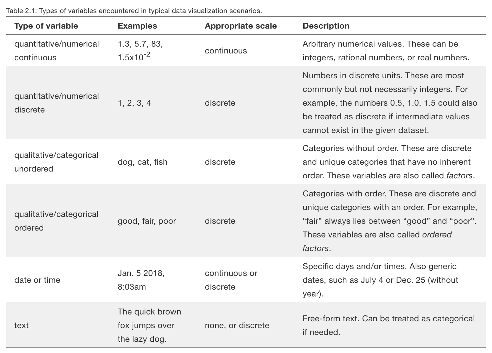
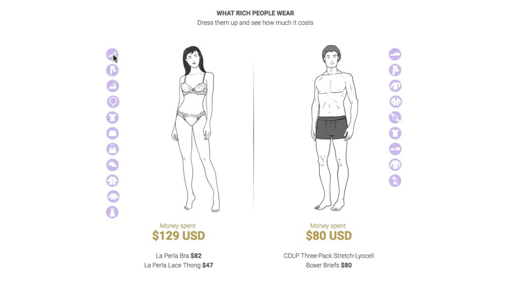
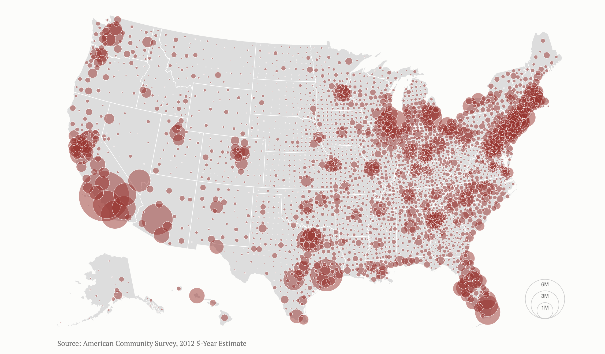
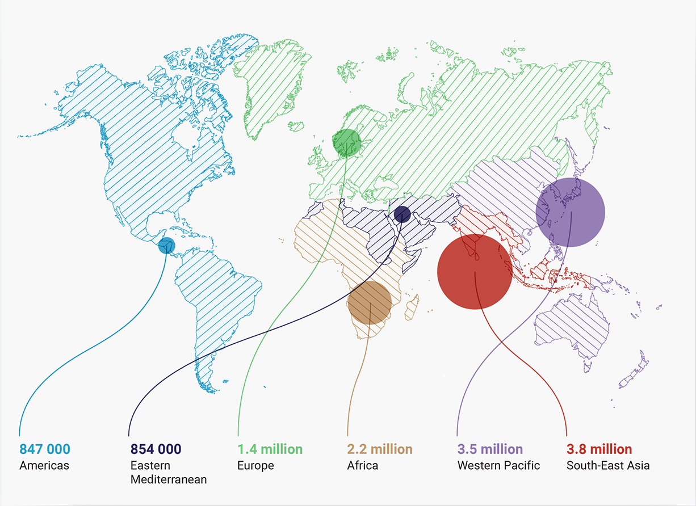

# 08 Intro to Data Visualization

> “There is no such thing as information overload. There is only bad design.” ~ Edward Tufte

**Source:** https://boostlabs.com/

## Notebook Structure

1. Recap of Module 3
2. Learning Outcomes
3. Introduction to Data Visualization
4. Quantitative vs Qualitative
5. Static vs Interactive DataViz
6. Do's & Dont's
7. Tools

# 1. Recap of Module 3

In the last lesson we covered pandas in great lenght, and still, we have not yet to scratch the surface of what this powerful tool can do. Some of keypoints to take away from last lesson are:

- pandas provides two fantastic data structures for data analysis, the DataFrame and the Series
- We can slice and dice these data structures to our hearts content all while keeping in mind the inconsistencies that we might find in different datasets
- We should always begin by inspecting our data immediately after loading it into our session. pandas provides methods such as info, describe, and isna that work very well and allow us to see what we have the data
- When cleaning data, missing values need to be treated carefully as the reasons behind them might differ from one variable to the next.
- Always keep in mind to
    - Check for duplicates
    - Normalise columns
    - Deal with missing values, preferably with stakeholders or subject matter experts if the amount of missing values is vast
    - Use dates to your advantage
- Don't try to learn all the tools inside pandas but rather explore the ones you need as the need arises, or, explore them slowly and build an intuition for them

## 2. Learning Outcomes

By the end of the lesson you will have learned:

1. What is data visualisation and how does it fit in the data analytics cycle.
2. How to differentiate between quantitative vs qualitative data for visualisation purposes.
3. When to use static vs interactive data visualisations.
4. How to get started creating your own visualisations while thinking of the kinds of data you are trying to plot.

# 3. Introduction to Data Visualization

Data visualisation, more than being part art and part science, is one of the key components of the data analytics cycle. People have different learning styles and to be able to convey information in a more accessible way, sometimes it is better to do so through visualisations rather than tables and written text. So..

## What is DataViz?

> "Data visualization is the graphical representation of information and data. By using visual elements like charts, graphs, and maps, data visualization tools provide an accessible way to see and understand trends, outliers, and patterns in data." ~ [Tableau](https://www.tableau.com/learn/articles/data-visualization)

Data Visualization as a field of study has been on the rise for over many decades now --if not centuries-- and it is an exciting area to be a part of. Organisations such as the [Data Visualization Society](https://www.datavisualizationsociety.com/), FreeCodeCamp, and others, have extensive information on how to go beyond simple data visualisation, should that be something that interests you. If you would like to read more about data visualisation and what you can do with it, check out this [medium site](https://medium.com/nightingale).

## 4. Quantitative vs Qualitative

When we get to the data visualisation stage of the data analytics cycle, we should always keep in mind the nature of the data we would like to visualise. If we want to see relationships (correlations between variables) we might only choose quantitative variables for our visualisations. If we want to show a specific theme in our dataset, e.g. gender differences, customer type, or potential customer, we might just opt for visualising frequencies in qualitative data. In contrast, if we want to show the relationship of variables given a specific group in our dataset (e.g. income differences by gender), we would choose a combination of qualitative and quantitative variables.

To give you a more concrete example, I have burrowed the following table from a book that I highly recommend if you want to really get started with data visualization, and that is, _"Fundamentals of data visualization: A primer on making informative and compelling figures"_ by Claus O. Wilke.

**Source:** Wilke, C. O. (2019). _Fundamentals of data visualization: A primer on making informative and compelling figures._ Sebastopol, CA: O'Reilly Media.

Now that we are aware of the subtle differences in data visualization, how do we know which visualisation to create with the data we have? The answer is that it will depend on the context of your task, and on how much information you would like to convey in your visualisation. As you decompose a task to choose the best course of action for your visualisation, keep the following diagram in mind from ActiveWizards.

  
**Source:** https://activewizards.com/

## 5. Static vs Interactive Visualizations

An important aspect to keep in mind is when creating visualizations is whether we should represent our data in a static or interactive format. As analysts, we should always ask ourselves, will our message reach our audience better if they were able to interact with the visualisation? The reason behind this can be captured in a very famous quote by Benjamin Franklin.

> "Tell me and I forget. Teach me and I remember. Involve me and I learn." ~ Benjamin Franklin

If the goal of our visualisations is to teach something to our audience chances are that, allowing them to interact with our visualisation will do just that. Let's talk a bit more about static and interactive visualisations.

### Static DataViz

**Source:** ["The Most Violent Cities" by Federica Fragapane](https://www.behance.net/FedericaFragapane)

Static data visualisations are those meant to show one or several facts about the data in a specific way. They help us convey a message and are often used closely with other narratives. For example, the New York Times is one of the most famouss new agencies in the world not just for the top content they manage to craete and provide to the masses, but also for the beautiful visualisations one can find in their large amounts of information.

Static visualisations are also often embedded in inforgraphics to carry a message even further. Think about the graphs that are displayed in broshures that tell us to buy a fragance or a particular type of cutlery alongside a statistic, some often say "75% of those who purchased these products have experienced...blah blah blah". Watch out for those :)

### Interactive DataViz

**Source:** [South China Morning Post](https://multimedia.scmp.com/lifestyle/article/2163738/crazy-rich-asians/index.html). Authors - Pablo Robles and Adolfo Arranz, in collaboration with Marco Hernández, Vincenzo La Torre, Darren Long and Sean Keeley

Interactive data visualisations tell different stories while letting the users pick which one they would like to see or understand better as they evaluate the piece of work. These kinds of visualisations can be very powerful tools not only to convey messages to many people but also to provide top-notch educational content for others.

Involving your audience through interactive visualisations can be a much more involved process though. A static visualisation can be saved and shared with many in a matter of minutes. Interactive visualisations, on the other hand, might require a web application to work and be displayed, making it more difficult to show it to people on the go. Dashboards and other tools, while requiring a bit more work to be put together, can have a lot useful interactivity in them.

# 6. Do's & Dont's

  
**Source:** http://rhythm-of-food.net/

There are other factors we need to keep in mind when we visualise data. The most important ones are

1. what are we trying to visualise
2. what kind of data do we have? Is it quantitative, qualitative, both?
3. who will be seeing or evaluating our visualisations?
4. will our audience benefit from interacting with the visualisation, or will a static representations suffice?

Why should we pay attention to the data type? Visualisations with quantitative data will help us show relationships in our data, that is, what happens to the movement of one variable when compared to another. In the case of categorical data, we might want to show the frequency with which an event has happened in the past, for example, how many times did a customer go to the ice-cream shop last week in comparison to the previous one. This kind of information can be represented as a bar chart since it contains discrete numbers.

| When? | How many? | Who? |
|-----|---------|----|
|week1 | 2 | customer 1 |
|week2 | 1 | customer 1 |
|week1 | 2 | customer 2 |
|week3 | 3 | customer 1 |
|week2 | 2 | customer 2 |
|week3 | 1 | customer 2 |

What kind of data do you have? The kind of data you have -- whether quantitative, qualitative, time series or geographical -- will dictate the range of visualisations you can do with it. At the same time, the more data types you have, the broader the range of visualisations you can create. Geographical data, in particular, is perfect for using it in combination with other data types. See, for example, the map by Mike Bostock below, which shows the population of the United States by county.

  
**Source:** https://bost.ocks.org/mike/bubble-map/

Here we have geographical data and discrete quantitative data. The larger the population of a county, in whole numbers of course, the larger the size of the bubble.

Who will be seeing or evaluating your visualisation? This point is crucial, if the visualisation is just for us to understand a specific part of our dataset, then we might not have to create it with as much detail as we would for an audience we were presenting information to. After all, we know this visualisation will only be seen by us. In contrast, if we create a data visualisation to help our boss evaluate a specific analysis, or for an audience of colleagues working on a particular project, we want to make it as easy as possible to understand the message we are trying to convey, and in the appropriate context.

Context is essential for clarity. If we are presenting a technical insight to a non-technical audience, the message and the presentation will need to be adjusted accordingly. The reach of our message sometimes is more important than the technical little details of it.

Another important aspect to keep in mind is interactivity. As analysts, we should always ask ourselves, will our message reach our audience better if they were able to interact with the visualisation? The reason behind this can be captured in a very famous quote by Benjamin Franklin.

> "Tell me and I forget. Teach me and I remember. Involve me and I learn." ~ Benjamin Franklin

If the goal of our visualisations is to teach something to our audience, chances are that allowing them to interact with our visualisation will do just that. Let's talk a bit more about static and interactive visualisations.

## Do's

When creating data visualisations, it is important to keep in mind the following Do's.

- Label your axes where appropriate
- Add a title
- Use color appropriately. Showcase what you need, not every data point
- Use full axis and maintain consistency with different graphs shown in parallel
- Ask others for their opinion
- Pass the squint test (blurry viz)

Good examples

1. Good use of color, information, and background space

**Source:** [Federica Fragapane](https://www.behance.net/FedericaFragapane)

2. Good data visualisations tell stories

**Source:** [Giorgia Lupi](http://giorgialupi.com/new-page)

3. Be informative

**Source:** [Giorgia Lupi](http://giorgialupi.com)

## Dont's

Just as there are many **Do's** in data visualisations, there are also many **DONT's**. Let go over a few of them together.

1. Don't use too much color  
   

2. Don't use unmatching percentages  
  

3. Don't try to put everything in one graph  
  

4. Trend lines need time not categories  
  

5. Don't make your chart data unreadible  
  

6. Don't make no sense  
  

7. Don't deceive your audience with different intervals and axes  
  

8. Axes betrayal  
  

**Source 1:** taken from Fundamentals of Data Visualization by Claus O. Wilke. Data source is US Census Bureau  
**Source 2:** Figures 2, 3, 4, and 5 were taken from [QlikView](http://livingqlikview.com/the-9-worst-data-visualizations-ever-created/)  
**Source 3:** Figures 6, 7, and 8 were taken from [Business Insider](https://www.businessinsider.com.au/the-27-worst-charts-of-all-time-2013-6?r=US&IR=T#did-anyone-learn-anything-by-looking-at-this-pseudo-pie-chart-what-do-these-colors-even-mean-why-is-it-divided-into-quadrants-well-never-know-1)

## 7. Tools

Python has a wide variety of visualisation tools available for static and interactive, quantitative and qualitative, time series and geographic data visualisation, and some of the most-widely used libraries for these purposes, to date, are the following ones:

- [matplotlib](https://matplotlib.org/) --> highly customisable and long-term contender in the dataviz arena
- [seaborn](https://seaborn.pydata.org/) --> beautiful data visualisation library that is easy to use and fast
- [bokeh](https://bokeh.org/) --> great (and beautiful) tool for interactive data visualisation
- [plotly](https://plotly.com/) --> bokeh's top contender
- [altair](https://altair-viz.github.io/) --> beautiful data visualisation library based on the grammar of graphics philosophy
- [plotnine](https://plotnine.readthedocs.io/en/stable/) --> data visualisation library based on R's ggplot2
